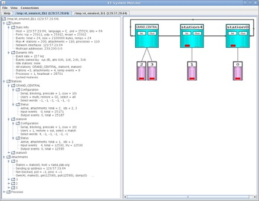

----------------------------
# **ET SOFTWARE PACKAGE**
----------------------------

The ET or Event Transfer system is used to transfer "events" (data buffers)
between different user processes using shared memory. It's designed
for speed and reliability. Remote access to ET system data is possible
over TCP sockets as well. 

ET is written for use in either C or Java programming environments.

# **Useful Links**

Documentation on GitHub:

* [All Links](https://jeffersonlab.github.io/et)

Software Library Documentation:

* [User's Guide PDF](https://jeffersonlab.github.io/et/doc/users_guide/ET_Users_Guide.pdf)
* [Doxygen for C Library](https://jeffersonlab.github.io/et/doc/doxygen/C/html/index.html)
* [Javadoc for Java Library](https://jeffersonlab.github.io/et/doc/javadoc/index.html)

# **Getting Started**

## **C Library**

To build C code from this repository:

    git clone https://github.com/JeffersonLab/et/
    cd et; mkdir build
    cmake -S . -B build
    cmake --build build --target install --parallel

Note that during the cmake configure step (first of two `cmake` commands above), one can
toggle the following special flag:

* `MAKE_EXAMPLES`: build example/test programs (default `-DMAKE_EXAMPLES=0`)
* `CODA_INSTALL`: installs in this base directory. If not used,
then the env variable \${CODA} location is next checked. Otherwise defaults to \${CMAKE_HOST_SYSTEM_NAME}-\${CMAKE_HOST_SYSTEM_PROCESSOR}, typically something like `[evio_directory]/Linux-x86_64`.

### Prerequisites

C 11 or higher and `cmake`. Compilation can be done using `clang` or `gcc` (gcc 11 or higher recommended). Java 8 or higher is needed if compiling the library `et_jni` (used to speed up the Java interface, recommended but not required).

## **Java Library**

The Java version of et (internally `org.jlab.coda.et`) can also be used for the same process-to-process copying of data. A "fat" jar file with all dependencies is included in the `java/jars` folder, the only thing strictly required to run and execute `et` in Java.

Java 17 is the default version used, however the Java et library should be compatible with all
Java versions 8 and higher. If one wants to create a 
new jar file for any reason (e.g. to modify Java versions), do:

    git clone https://github.com/JeffersonLab/evio/
    cd evio
    ./gradlew

It was written by Carl Timmer of the Data Acquisition group of the
Thomas Jefferson National Accelerator Facility.

This software runs on Linux and Mac OSX.
VxWorks is no longer supported in this version.

----------------------------

### **ET System figure which shows threads and event flow**

-----------------------------
## **MacOS**

The jni.h and jni_md.h header files
supplied with the java JDK have lived in different places over the years.
These are needed for compilation. The best way to facilitate that is to
set your JAVA_HOME environment variable so that these includes can be found.
These days the Oracle Java is placed so that you need to do a:

    setenv JAVA_HOME /Library/Java/JavaVirtualMachines/<jdk_dir>/Contents/Home

where <jdk_dir> is the directory in which your specific java distribution lives.
This package assumes the header files are found in $JAVA_HOME/include and in
$JAVA_HOME/include/darwin.

----------------------------

# **Gui showing the state of an ET system**

----------------------------

There is a java-based GUI to monitor ET systems graphically. It can connect to ET processes,
whether they were started using C binaries or in Java. 

It can be started by executing the script:

    scripts/etmonitor

See 

----------------------------

----------------------------

# **Copyright**

----------------------------

For any issues regarding use and copyright, read the [license](LICENSE.txt) file.

