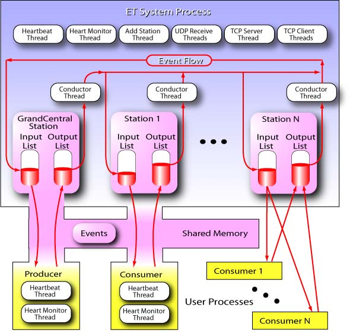

----------------------------

# **ET 16.5 SOFTWARE PACKAGE**

----------------------------

The ET or Event Transfer system is used to transfer events (data buffers)
between different user processes using shared memory. It's designed
for speed and reliability. Remote access to ET system data is possible
over TCP sockets as well.
 
It was written by Carl Timmer of the Data Acquisition group of the
Thomas Jefferson National Accelerator Facility.

This software runs on Linux and Mac OSX.
VxWorks is no longer supported in this version.

You must install Java version 8 or higher if you plan to compile
the ET java code and run it. If you're using the jar file from the CODA
website, Java 8 or higher is necessary since it was compiled with that version.

----------------------------

### **ET System figure which shows threads and event flow**

----------------------------

### **Main ET links:**

  [ET Home Page](https://coda.jlab.org/drupal/content/event-transfer-et/)

  [ET on GitHub](https://github.com/JeffersonLab/et)

  
-----------------------------

# **Documentation**

----------------------------

Documentation on GitHub:

* [All Documentation](https://jeffersonlab.github.io/et)

Documentation on the home page:

* [User's Guide PDF](https://coda.jlab.org/drupal/content/et-164-users-guide)
* [Javadoc for Java Library](https://coda.jlab.org/drupal/content/et-164-javadoc)
* [Doxygen for C Library](https://coda.jlab.org/drupal/content/et-164-doxygen)

----------------------------

# **C Library**

----------------------------

There are 3 separate C libraries that are built. The first is the full ET library,
libet, with all of the functionality. The second is a library, libet_remote,
for remote users of an existing ET system. This library has none of the code
to start up an ET system, but does communicate over the network with an existing system.
Originally, this was done because ET clients needed to run on the VxWorks operating
system and this avoided having to port difficult code to it. Finally, the third library,
et_jni, is the JNI shared library to allow Java classes to wrap C client code.
This results in significant performance gain since a C-based ET system can be used
instead of a Java-based system which is much less performant. This library can only
be made if a Java JDK is installed on the user’s host.

-----------------------------
## **Compiling using SCons**

From the SCons website:
>SCons is an Open Source software
>construction tool -- that is, a next-generation build tool.
>Think of SCons as an improved, cross-platform substitute for
>the classic Make utility with integrated functionality similar
>to autoconf/automake and compiler caches such as ccache. In short,
>SCons is an easier, more reliable and faster way to build software.

SCons is written in python, thus to use this build system with ET,
both python and SCons packages need previous installation. If your
system does not have one or the other, go to the http://www.python.org/
and http://www.scons.org/ websites for downloading.

The SCons files needed for compiling are already included as part of
the ET distribution. To compile, the user needs merely to run "scons"
in the top level ET directory. To compile and install libraries and
header files, first define the CODA environmental variable containing
the directory in which to install things and then run:

    scons install

The following are the options of scons seen by executing _**scons -h**_:

Command | Action
------------ | -------------
scons -h             | print out help
scons                | make C libraries
scons -c             | remove all generated files
scons install        | make C libraries,
.                    | place libraries in architecture-specific lib directory
.                    | make binaries
.                    | place execsrc binaries in architecture-specific bin directory
.                    | place example binaries in bin/examples directory
.                    | place test binaries in bin/test directory
.                    | place headers in include directory
scons install -c     | uninstall libs, headers, and binaries
scons tar            | create a tar file (et-16.x.tgz) of the ET top level
.                    | directory and put in ./tar directory
scons doc            | generate html documentation from javadoc and doxygen
.                    | comments in the source code and put in ./doc directory
scons undoc          | remove the doc/javadoc directory
scons --dbg          | compile with debug flag
scons --no-rwlock    | compile without read-write lock used for preventing access of unmapped
.                    | memory after calling et_close. This flag is necessary on platforms that
.                    | do not support POSIX read-write locks. This lock is a
.                    | safety feature and not necessary for proper operation.
scons --32bits       | compile 32bit libraries & executables on 64bit system
scons --prefix=<dir> | use base directory <dir> when doing install.
.                    | Defaults to CODA environmental variable.
.                    | Libs go in <dir>/<arch>/lib, headers in <dir>/<arch>/include
.                    | and executables in <dir>/<arch>/bin
scons --incdir=<dir> | copy header files to directory <dir> when doing install
.                    | (takes precedence over --prefix or default location)
scons --libdir=<dir> | copy library files to directory <dir> when doing install
.                    | (takes precedence over --prefix or default location)
scons --bindir=<dir> | copy executable files to directory <dir> when doing install
.                    | (takes precedence over --prefix or default location)

Note that currently only Linux and Darwin (Mac OSX)
operating systems are supported. The libraries and executables
are placed into the _**$CODA/[arch]/lib**_ and _**bin**_ subdirectories
(eg. ...Linux-x86_64/lib).  Be sure to change your LD_LIBRARY_PATH
environmental variable to include the correct lib directory.

-----------------------------
## **Compiling using CMake**

ET can also be compiled with cmake using the included CMakeLists.txt file.
To build the libraries and executables on the Mac:

    cd <et dir>
    mkdir build
    cd build
    cmake –DCMAKE_BUILD_TYPE=Release ..
    make

In order to compile all the examples as well, place –DMAKE_EXAMPLES=1 on the cmake command line.
The above commands will place everything in the current “build” directory and will keep generated
files from mixing with the source and config files.

In addition to a having a copy in the build directory, installing the library, binary and include
files can be done by calling cmake in 3 ways:

    cmake –DCMAKE_BUILD_TYPE=Release –DINSTALL_DIR=<install dir> ..
    make install

This 1st option explicitly sets the installation directory as $INSTALL_DIR/ and under that in the include, lib, and bin dirs.

or

    cmake –DCMAKE_BUILD_TYPE=Release –DCODA_INSTALL=<install dir> ..
    make install

This 2nd option explicitly sets the installation include directory as $CODA_INSTALL/ and under that
in the common/include, &lt;arch&gt;/lib, and &lt;arch&gt;/bin dirs.

or

    cmake –DCMAKE_BUILD_TYPE=Release ..
    make install

This 3rd option installs includes in the directory, using the CODA environmental variable, in
$CODA/ and under that in the common/include, &lt;arch&gt;/lib, and &lt;arch&gt;/bin dirs.

If cmake was run previously, remove the CMakeCache.txt file so
new values are generated and used.

To uninstall simply do:

    make uninstall

-----------------------------
## **Macs**

A word about making C libs on the Mac. The jni.h and jni_md.h header files
supplied with the java JDK have lived in different places over the years.
These are needed for compilation. The best way to facilitate that is to
set your JAVA_HOME environmental variable so that these includes can be found.
These days the Oracle Java is placed so that you need to do a:

    setenv JAVA_HOME /Library/Java/JavaVirtualMachines/<jdk_dir>/Contents/Home

where <jdk_dir> is the directory in which your specific java distribution lives.
This package assumes the header files are found in $JAVA_HOME/include and in
$JAVA_HOME/include/darwin.

----------------------------

# **Java**

----------------------------

One can download the Java 8, pre-built et-16.5.jar file from either:

  [Jar File @ Home Page](https://coda.jlab.org/drupal/content/et-164)
 
or

  [Jar File @ GitHub](https://github.com/JeffersonLab/et/blob/master/java/jars/java8/et-16.5.jar)

One can find the pre-built et-16.5.jar file in the repository in the java/jars/java8
directory built with Java 8, or in the java/jars/java15 directory built with Java 15,
or it can be generated. The generated jar file is placed in build/lib.
In any case, put the jar file into your classpath and run your java application.

If you're using the pre-built jar file, Java version 8 or higher is necessary since
it was compiled with that version. Also, when generating it, it’s advisable to use
Java version 8 or higher since all other pre-built CODA jar files have been compiled with Java 8.
If you wish to recompile the java part of ET, ant must be installed
on your system (http://ant.apache.org):
  
    cd <et dir>
    ant

To get a list of options with ant, type _**ant help**_:

    help: 
        [echo] Usage: ant [ant options] <target1> [target2 | target3 | ...]
    
        [echo]      targets:
        [echo]      help        - print out usage
        [echo]      env         - print out build file variables' values
        [echo]      compile     - compile java files
        [echo]      clean       - remove class files
        [echo]      cleanall    - remove all generated files
        [echo]      jar         - compile and create jar file
        [echo]      install     - create jar file and install into 'prefix'
        [echo]                    if given on command line by -Dprefix=dir',
        [echo]                    else install into CODA if defined
        [echo]      uninstall   - remove jar file previously installed into 'prefix'
        [echo]                    if given on command line by -Dprefix=dir',
        [echo]                    else installed into CODA if defined
        [echo]      all         - clean, compile and create jar file
        [echo]      javadoc     - create javadoc documentation
        [echo]      developdoc  - create javadoc documentation for developer
        [echo]      undoc       - remove all javadoc documentation
        [echo]      prepare     - create necessary directories

To generate a new ET jar file, type "ant jar" which will
create the file and place it in build/lib.

Included in the java/jars subdirectory are all auxiliary jar files used
by the GUI graphics. These are installed when executing "ant install"
and uninstalled when executing "ant uninstall".

----------------------------

# **Generating Documentation**

----------------------------

All documentation links are provided above.

However, if using the downloaded distribution, some of the documentation
needs to be generated and some already exists. For existing docs look in
doc/users_guide and doc/developers_guide for pdf and Microsoft Word
format documents.

Some of the documentation is in the source code itself and must be generated
and placed into its own directory.
The java code is documented with, of course, javadoc and the C code is
documented with doxygen comments (identical to javadoc comments).

To generate all the these docs, from the top level directory type:

    scons doc
    
To remove it all type:

    scons undoc

The javadoc is placed in the doc/javadoc directory.
The doxygen docs for C code are placed in the doc/doxygen/C/html directory.
To view the html documentation, just point your browser to the index.html
file in that directory.
In the C html docs, select the "modules" option to get a nice summary
of all routines needed by a user.

Alternatively, just the java documentation can be generated by typing

    ant javadoc
    
for user-level documentation, or

    ant developdoc
    
for developer-level documentation. To remove it:

    ant undoc

----------------------------

# **Copyright**

----------------------------

For any issues regarding use and copyright, read the [license](LICENSE.txt) file.

